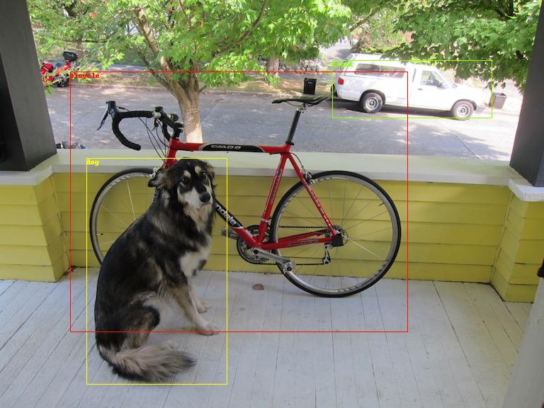

### pytorch-yolo3
Convert https://pjreddie.com/darknet/yolo/ into pytorch. Currently this repository works on Python 3.6.1  + pytorch 0.3.1.post3

This python3 version is merged from https://github.com/Swall0w/pytorch-yolo3

### Todos
- [x] make detect.py works

---
#### Detection Using A Pre-Trained Model
```
wget https://pjreddie.com/media/files/yolov3.weights
python detect.py cfg/yolov3.cfg yolov3.weights data/dog.jpg
```
You will see some output like this:
```
layer     filters    size              input                output
    0 conv     32  3 x 3 / 1   416 x 416 x   3   ->   416 x 416 x  32
    1 conv     64  3 x 3 / 2   416 x 416 x  32   ->   208 x 208 x  64
    2 conv     32  1 x 1 / 1   208 x 208 x  64   ->   208 x 208 x  32
    3 conv     64  3 x 3 / 1   208 x 208 x  32   ->   208 x 208 x  64
    4 shortcut 1
    5 conv    128  3 x 3 / 2   208 x 208 x  64   ->   104 x 104 x 128
    6 conv     64  1 x 1 / 1   104 x 104 x 128   ->   104 x 104 x  64
    7 conv    128  3 x 3 / 1   104 x 104 x  64   ->   104 x 104 x 128
    8 shortcut 5
    9 conv     64  1 x 1 / 1   104 x 104 x 128   ->   104 x 104 x  64
   10 conv    128  3 x 3 / 1   104 x 104 x  64   ->   104 x 104 x 128
   11 shortcut 8
   12 conv    256  3 x 3 / 2   104 x 104 x 128   ->    52 x  52 x 256
   13 conv    128  1 x 1 / 1    52 x  52 x 256   ->    52 x  52 x 128
   14 conv    256  3 x 3 / 1    52 x  52 x 128   ->    52 x  52 x 256
   15 shortcut 12
   16 conv    128  1 x 1 / 1    52 x  52 x 256   ->    52 x  52 x 128
   17 conv    256  3 x 3 / 1    52 x  52 x 128   ->    52 x  52 x 256
   18 shortcut 15
   19 conv    128  1 x 1 / 1    52 x  52 x 256   ->    52 x  52 x 128
   20 conv    256  3 x 3 / 1    52 x  52 x 128   ->    52 x  52 x 256
   21 shortcut 18
   22 conv    128  1 x 1 / 1    52 x  52 x 256   ->    52 x  52 x 128
   23 conv    256  3 x 3 / 1    52 x  52 x 128   ->    52 x  52 x 256
   24 shortcut 21
   25 conv    128  1 x 1 / 1    52 x  52 x 256   ->    52 x  52 x 128
   26 conv    256  3 x 3 / 1    52 x  52 x 128   ->    52 x  52 x 256
   27 shortcut 24
   28 conv    128  1 x 1 / 1    52 x  52 x 256   ->    52 x  52 x 128
   29 conv    256  3 x 3 / 1    52 x  52 x 128   ->    52 x  52 x 256
   30 shortcut 27
   31 conv    128  1 x 1 / 1    52 x  52 x 256   ->    52 x  52 x 128
   32 conv    256  3 x 3 / 1    52 x  52 x 128   ->    52 x  52 x 256
   33 shortcut 30
   34 conv    128  1 x 1 / 1    52 x  52 x 256   ->    52 x  52 x 128
   35 conv    256  3 x 3 / 1    52 x  52 x 128   ->    52 x  52 x 256
   36 shortcut 33
   37 conv    512  3 x 3 / 2    52 x  52 x 256   ->    26 x  26 x 512
   38 conv    256  1 x 1 / 1    26 x  26 x 512   ->    26 x  26 x 256
   39 conv    512  3 x 3 / 1    26 x  26 x 256   ->    26 x  26 x 512
   40 shortcut 37
   41 conv    256  1 x 1 / 1    26 x  26 x 512   ->    26 x  26 x 256
   42 conv    512  3 x 3 / 1    26 x  26 x 256   ->    26 x  26 x 512
   43 shortcut 40
   44 conv    256  1 x 1 / 1    26 x  26 x 512   ->    26 x  26 x 256
   45 conv    512  3 x 3 / 1    26 x  26 x 256   ->    26 x  26 x 512
   46 shortcut 43
   47 conv    256  1 x 1 / 1    26 x  26 x 512   ->    26 x  26 x 256
   48 conv    512  3 x 3 / 1    26 x  26 x 256   ->    26 x  26 x 512
   49 shortcut 46
   50 conv    256  1 x 1 / 1    26 x  26 x 512   ->    26 x  26 x 256
   51 conv    512  3 x 3 / 1    26 x  26 x 256   ->    26 x  26 x 512
   52 shortcut 49
   53 conv    256  1 x 1 / 1    26 x  26 x 512   ->    26 x  26 x 256
   54 conv    512  3 x 3 / 1    26 x  26 x 256   ->    26 x  26 x 512
   55 shortcut 52
   56 conv    256  1 x 1 / 1    26 x  26 x 512   ->    26 x  26 x 256
   57 conv    512  3 x 3 / 1    26 x  26 x 256   ->    26 x  26 x 512
   58 shortcut 55
   59 conv    256  1 x 1 / 1    26 x  26 x 512   ->    26 x  26 x 256
   60 conv    512  3 x 3 / 1    26 x  26 x 256   ->    26 x  26 x 512
   61 shortcut 58
   62 conv   1024  3 x 3 / 2    26 x  26 x 512   ->    13 x  13 x1024
   63 conv    512  1 x 1 / 1    13 x  13 x1024   ->    13 x  13 x 512
   64 conv   1024  3 x 3 / 1    13 x  13 x 512   ->    13 x  13 x1024
   65 shortcut 62
   66 conv    512  1 x 1 / 1    13 x  13 x1024   ->    13 x  13 x 512
   67 conv   1024  3 x 3 / 1    13 x  13 x 512   ->    13 x  13 x1024
   68 shortcut 65
   69 conv    512  1 x 1 / 1    13 x  13 x1024   ->    13 x  13 x 512
   70 conv   1024  3 x 3 / 1    13 x  13 x 512   ->    13 x  13 x1024
   71 shortcut 68
   72 conv    512  1 x 1 / 1    13 x  13 x1024   ->    13 x  13 x 512
   73 conv   1024  3 x 3 / 1    13 x  13 x 512   ->    13 x  13 x1024
   74 shortcut 71
   75 conv    512  1 x 1 / 1    13 x  13 x1024   ->    13 x  13 x 512
   76 conv   1024  3 x 3 / 1    13 x  13 x 512   ->    13 x  13 x1024
   77 conv    512  1 x 1 / 1    13 x  13 x1024   ->    13 x  13 x 512
   78 conv   1024  3 x 3 / 1    13 x  13 x 512   ->    13 x  13 x1024
   79 conv    512  1 x 1 / 1    13 x  13 x1024   ->    13 x  13 x 512
   80 conv   1024  3 x 3 / 1    13 x  13 x 512   ->    13 x  13 x1024
   81 conv    255  1 x 1 / 1    13 x  13 x1024   ->    13 x  13 x 255
   82 detection
   83 route  79
   84 conv    256  1 x 1 / 1    13 x  13 x 512   ->    13 x  13 x 256
   85 upsample           * 2    13 x  13 x 256   ->    26 x  26 x 256
   86 route  85 61
   87 conv    256  1 x 1 / 1    26 x  26 x 768   ->    26 x  26 x 256
   88 conv    512  3 x 3 / 1    26 x  26 x 256   ->    26 x  26 x 512
   89 conv    256  1 x 1 / 1    26 x  26 x 512   ->    26 x  26 x 256
   90 conv    512  3 x 3 / 1    26 x  26 x 256   ->    26 x  26 x 512
   91 conv    256  1 x 1 / 1    26 x  26 x 512   ->    26 x  26 x 256
   92 conv    512  3 x 3 / 1    26 x  26 x 256   ->    26 x  26 x 512
   93 conv    255  1 x 1 / 1    26 x  26 x 512   ->    26 x  26 x 255
   94 detection
   95 route  91
   96 conv    128  1 x 1 / 1    26 x  26 x 256   ->    26 x  26 x 128
   97 upsample           * 2    26 x  26 x 128   ->    52 x  52 x 128
   98 route  97 36
   99 conv    128  1 x 1 / 1    52 x  52 x 384   ->    52 x  52 x 128
  100 conv    256  3 x 3 / 1    52 x  52 x 128   ->    52 x  52 x 256
  101 conv    128  1 x 1 / 1    52 x  52 x 256   ->    52 x  52 x 128
  102 conv    256  3 x 3 / 1    52 x  52 x 128   ->    52 x  52 x 256
  103 conv    128  1 x 1 / 1    52 x  52 x 256   ->    52 x  52 x 128
  104 conv    256  3 x 3 / 1    52 x  52 x 128   ->    52 x  52 x 256
  105 conv    255  1 x 1 / 1    52 x  52 x 256   ->    52 x  52 x 255
  106 detection
Loading weights from yolov3.weights... Done!
data/dog.jpg: Predicted in 1.405360 seconds.
dog: 0.999996
truck: 0.995232
bicycle: 0.999972
save plot results to predictions.jpg
```


### Train on COCO
comming soon ...
